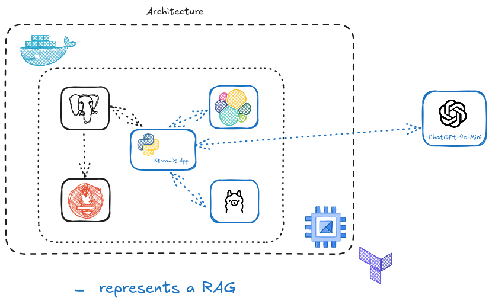

# LLM-Zoomcamp Final Project: Vague Interpreter

## Brief description of the project

Everyday one confronts with vague statements of his/her boss. Often a boss tries to formulate tasks, give pieces of advice indirect, which causes lots of misunderstanding. Experiencing this from time to time I considered it to be a good idea to build a RAG, which helps an IT employee to understand what a boss really wants. An example of such dialogue could be:

_Vague statement:_ We need to become speedy gonzales to get this mess done asap.
_Clear statement:_ We need to increase our efficiency and productivity to complete our tasks as soon as possible.

Hence an aim of this project is:
- to build a RAG system that gets a vague question/statement from a boss and 'translates' it into the form one can unambiguously understand
- build a UI for this RAG system
- containerize it and deploy to a GCP

## Data Generation
Since it is a sensible topic, the corresponding data has been generated using ChatGPT.
This is done using [this script](./data_utils/initial_data_generation.py). The corresponding output has been saved to ```data/initial_data.json```.

## Ground Truth Generation
Ground truth has been also generated using ChtaGPT (_gpt-4o-mini_ model). The result has been saved to ```data/ground_truth_data.csv```, see the corresponndig [code](./data_utils/generating_ground_truth_asyncio.py). This data has been used for a retrieval evaluation.

## Data Retrieval
Data Retrieval has been evaluated using __hit_rate__ and __mrr__ metrics. I refer to the [Evaluation retrieval notebook](./notebooks/retrieval_evaluation.ipynb).
The following retrieval possibilities has been considered:
 - Semantic search exploiting ```SentenceTransformer``` with the model _multi-qa-MiniLM-L6-cos-v1_.
 - Semantic search exploiting ```SentenceTransformer``` with the model _all-mpnet-base-v2_.
 - Keyword search.
 - Hybrid search.
  For every retrieval evaluation a separate index has been defined (see [ingestion code](./src/data_ingestion.py)) and a separate class for a search functionality has been introduced (see [elastic search code](./src/elastic_search_engine.py)). The results are as the following:

  | Metric   | keyword search | multi-qa-MiniLM-L6-cos-v1 | all-mpnet-base-v2 | hybrid search |
  | -------- | -------------- | ------------------------- | ----------------- |---------------| 
  | hit_rate | 0.95           | 0.87                      | 0.97              | 0.95          |  
  | mrr      | 0.90           | 0.81                      | 0.93              | 0.85          |      
 
 I will use a knn elastic search with __all-mpnet-base-v2__ module in the rest of the project.

_Disclaimer:_ The results are so good, since the data has been generated using ChatGPT, hence we do not have the variability of the real world. Of course, one can play with prompts to achieve it, but due to lack of time I leave it as it is.

## RAG

A RAG is defined through a Knowledge Base (in this case ElasticSearch with ingected [inital_data.json](./data/initial_data.json)) and wrapper over LLM, that is defined through an LLM model and a prompt with context and a request.

### RAG Evaluation
In the [evaluation notebook](./notebooks/rag_evaluation.ipynb) the offline evaluation for two rags, that are different in prompts they use, has been executed:
- The cosine similarity for [ground truth data](./data/ground_truth_data.csv) has been estimated and the correspondent distribution compared.
- The 2 RAGs has been compared using LLM-as-a-judge approach and the corresponding metrics has been visualized.
The RAG with a specific prompt has shown a much better quality and hence will be used in the _prod_ phase of the project. I refer to the beforementioned notebook for more details.

## Production phase

### CLI
This is the easiest possibility to serve it. Execute the following from the root folder of a project (assuming that Python 3.10 or higher, make and docker have been installed)
```bash
make run_all_cli
```
This starts docker container with Elastic Search, ingests the inital data and starts an easy CLI to interact with RAG.

### Streamlit Applicaiton


Streamlit Application (see [Dockerfile](Dockerfile)) together with related services have been [dockerized](docker-compose.yaml). To start it for the first time (then the ingestion will be triggered, this exploits _init_ container that is started, ingestion is being triggered and then it exists):
Rename ```dev.env``` to ```env``` and input the OPENAI_API_KEY.

```bash
    chmod +x start.sh
    ./start.sh
```

To start it once again:

```bash
make run_streamlit_application
```
For more details about the application, its monitoring, containerization and cloud deployment consult the [streamlit app documentation](StreamlitApplication.md). Provision of the infrastructure exploits terraform.