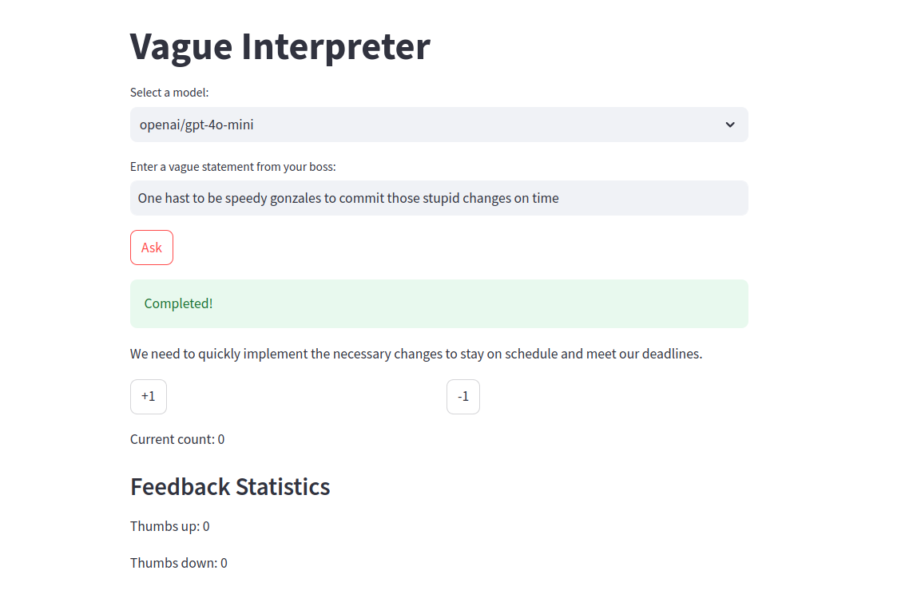
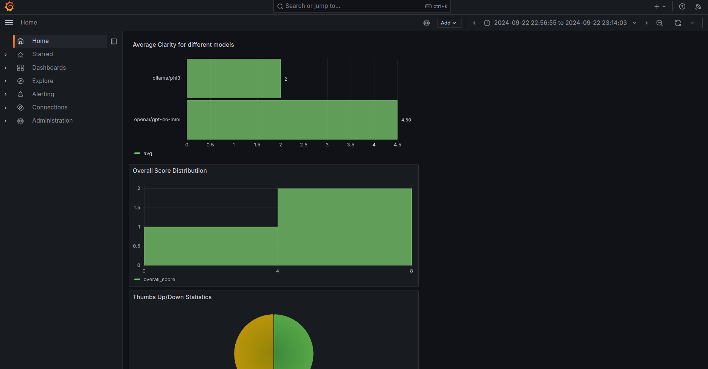
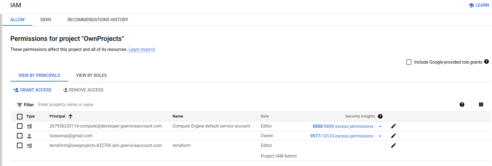
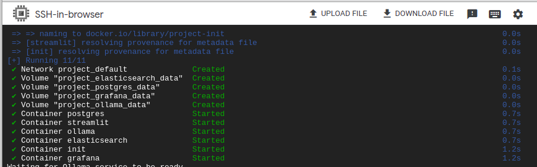

# Streamlit Application

## Containerization
The application consists of the following services
* ```elasticsearch```
    - Elasticsearch 8.4.3
    - Single-node setup
    - 5GB memory limit, 2GB JVM heap
    - Ports: 9200, 9300
* ```postgres```
     - PostgreSQL 13
     - Configurable database, user, password
     - Port: 5432 (configurable)
* ```init```
    - Custom initialization service
    - Runs only with "init" profile
    - Depends on elasticsearch and postgres
* ```streamlit```
    - Custom Streamlit application
    - Depends on init service
    - Port: 8501 (configurable)
* ```grafana```
    - Latest Grafana image
    - Port: 3000
    - Configurable admin password
    - Pre-configured dashboard
* ```ollama```
    - Latest Ollama image
    - Port: 11434
    - We can pull different models to serve them later

All services use named volumes for data persistence.

## Code
1. Implementation of an application relates on streamlit library.
2. The connection with database exploits _psycopg2_ library. CRUD operations are exploiting _sqlalchemy_.
3. Where it makes sense the code is parallelized using _asyncio_, _aiohttp_.
4. The connection to ChatGPT exploits openai library.
5. The code quality is maintained using ruff, hwoever with not the strictest checks.

## Ingestion

The ingestion is executed using ```ìnit``` container that calls a [script](src/initializing_application.py) (that also creates a database and auser with granted permissions).In its turn this script uses an async ingestion to an Elastic Search using [script](src/data_ingestion.py)

## Monitoring

```grafana``` service is reponsible for the application online monitoring. The default  dashboard is configured in [the corresponding folder](./grafana/). The following metrics are monitored:
1. Average clarity for different models
2. Overall Score Distribution.
3. Thumbs Up/Down Statistics.
4. Relevance counts
5. Response time panel.

Metrics 1, 2, 4 are calculated using [llm-as-a-judge](./src/judge_llm.py), the 3rd metric is a feedback from a user. The 5th metric is a characteristics of a RAG/Application.

To gather statistics quicker [a script](./src/create_artificial_data.py) that creates an artificial data and ingests it to the DB has been used.
Note: on the first login to Grafana one should change a password.

## Reproducibility

One needs only to
0. have Docker on a computer.
1. define an own ```.env``` file, that is similar to ```dev.env```.
2. execute from a root folder 
    ```bash
    chmod +x start.sh
    ./start.sh
    ```
3. wait until all services are up and the ingestion has been executed (Remark: unfortunately the _depens-on_ function od docker does NOT gurantee the correct order of container execution, one needs to work with definition of healthiness of a service, but I dont have time for this)
4. go to 8501 port on localhost and enjoy the applciation.
_Remark:_ The code dependencies are defined in Pipfile/Pipfile.lock.
_Remark:_ Sometimes changes graffan service the UUID of a data source, than one needs to go to the corresponding JSON definition of a dashboard and change th UUID on the new UUID of the current data source.

## Deployment to the cloud
The deployment to GCP VM is explained here in details:
*The following is assumed:**
0. The project has been cloned into a local environment (laptop):
   ```https://github.com/tarasenya/llm-zoomcamp.git```
1. One is the _Project_ folder of the repository.
2. CLI ```gcloud``` is installed and authorised to a GCP account:
3. The GCP project you want to use for the pet-project has been created (then change the variable "project" in ```infra/variables.tf``` to the defined name) and the project is set up as default for  ```gcloud```:
   ```gcloud config set project YOUR_PROJECT_ID```
4. The following APIs has been activated for the project:

| NAME                                	| TITLE                                    	|
|-------------------------------------	|------------------------------------------	|
| cloudapis.googleapis.com            	| Google Cloud APIs                        	|
| cloudresourcemanager.googleapis.com 	| Cloud Resource Manager API               	|
| cloudtrace.googleapis.com           	| Cloud Trace API                          	|
| compute.googleapis.com              	| Compute Engine API                       	|
| iam.googleapis.com                  	| Identity and Access Management (IAM) API 	|
| iamcredentials.googleapis.com       	| IAM Service Account Credentials API      	|
| monitoring.googleapis.com           	| Cloud Monitoring API                     	|
| oslogin.googleapis.com              	| Cloud OS Login API                       	|
| servicemanagement.googleapis.com    	| Service Management API                   	|
| serviceusage.googleapis.com         	| Service Usage API                        	|

Remark 1. To list all enabled APIs use:
```bash
gcloud services list --enabled --project YOUR_PROJECT_ID
```
Remark 2. To enable a missing API use:
```gcloud services enable SERVICE_NAME```

**Steps for provisioning:**
1. Create the terraform service account:
(details can be found in the [book](https://github.com/PacktPublishing/Terraform-for-Google-Cloud-Essential-Guide/tree/main) Terrafrom for Google Cloud Essential Guide by B. Nordhausen)
```bash
$ gcloud auth login --no-launch-browser
$ gcloud config set project "<PROJECT_ID>"  
$ gcloud iam service-accounts create terraform \
    --description="Terraform Service Account" \
    --display-name="terraform"

$ export GOOGLE_SERVICE_ACCOUNT=`gcloud iam service-accounts list --format="value(email)"  --filter=description:"Terraform Service Account"` 
$ export GOOGLE_CLOUD_PROJECT=`gcloud info --format="value(config.project)"`
$ gcloud projects add-iam-policy-binding $GOOGLE_CLOUD_PROJECT \
    --member="serviceAccount:$GOOGLE_SERVICE_ACCOUNT" \
    --role="roles/editor" 
$ gcloud projects add-iam-policy-binding $GOOGLE_CLOUD_PROJECT \
    --member="serviceAccount:$GOOGLE_SERVICE_ACCOUNT" \
    --role="roles/resourcemanager.projectIamAdmin"    
$ gcloud iam service-accounts keys create "./terraform.json"  \
  --iam-account=$GOOGLE_SERVICE_ACCOUNT 
```

The account on IAM & Admin service on GCP looks as the following:

1. Go to ```infra``` folder, copy the key ```terraform.json``` obtained in the previous step to this folder and execute (please be informed that this will cost some money):
   ```bash
   terraform init 
   terraform plan
   terraform apply
   # the last command can be substituted by:
   # terraform apply -var project=PROJECT_ID
   ```
2. The infrastructure is provisioned. Docker and docker compose have been automatically installed by the terrafrom script.

    The VM looks in the GCP console as the following:

3. Either connect to it on GCP or go to use standard SSH method to connect to it (for more details consult [this](https://cloud.google.com/compute/docs/connect/standard-ssh#gcloud)).

4. Clone a repository and go to _Project_ folder inside it:
   ```bash 
        git clone https://github.com/tarasenya/llm-zoomcamp.git
        cd llm-zoomcamp/Project
   ```
5. Rename ```dev.env``` to ```env``` and paste a valid _OPENAI_API_KEY_.
6. ```bash
      chmod +x start.sh
      ./start.sh
   ```   
7. The application is up and running and after a minute everything is ready to open an application (database operations and igestion are completed):
   

